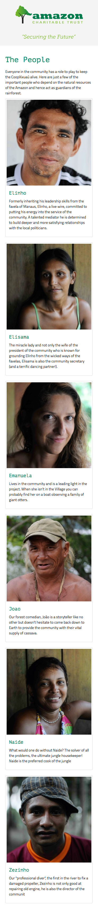
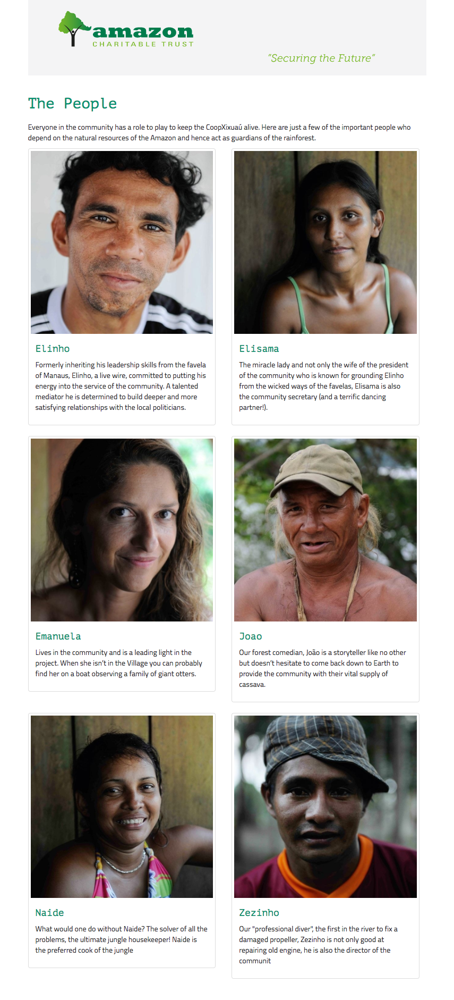
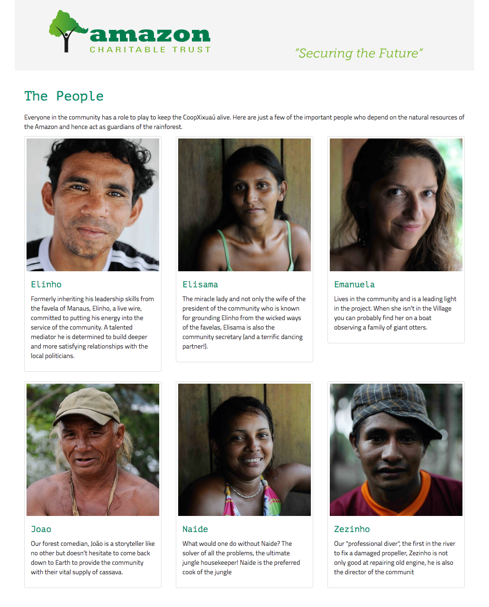

# Media Query Basics - Amazon Charity Trust

## Context
Amazon Charitable Trust was established to enable local communities in Brazil to implement sustainable business practices that preserve Amazon rain forests. They are looking to build a responsive front-end site that gives a profile of members from the XuXiau Community.

## The Assignment
Create a responsive site that realigns the layout for various viewport widths using media queries based on the mockups below.

Don't forget to include the viewport meta tag in the `<head>`.
```html
  <meta name="viewport" content="width=device-width, initial-scale=1.0">
```

The breakpoints are:
+ *768px* for tablet
+ *1,024px* for desktop


### The mockups

#### Mobile


#### Tablet


#### Desktop


### The text copy
<hr/>

```
Elinho

Formerly inheriting his leadership skills from the favela of Manaus, Elinho, a live wire, committed to putting his energy into the service of the community. A talented mediator he is determined to build deeper and more satisfying relationships with the local politicians.

...
Elisama

The miracle lady and not only the wife of the president of the community who is known for grounding Elinho from the wicked ways of the favelas, Elisama is also the community secretary (and a terrific dancing partner!).

...
Emanuela

Lives in the community and is a leading light in the project. When she isn’t in the Village you can probably find her on a boat observing a family of giant otters.

...
Joao

Our forest comedian, João is a storyteller like no other but doesn’t hesitate to come back down to Earth to provide the community with their vital supply of cassava.

...
Naide

What would one do without Naide? The solver of all the problems, the ultimate jungle housekeeper! Naide is the preferred cook of the jungle

...
Zezinho

Our "professional diver", the first in the river to fix a damaged propeller, Zezinho is not only good at repairing old engine, he is also the director of the communit

```

<hr/>

### Images `.zip` download
[download](https://github.com/muktek/assignment--media-query-layout-amazon-charity/blob/master/project-images.zip?raw=true)
